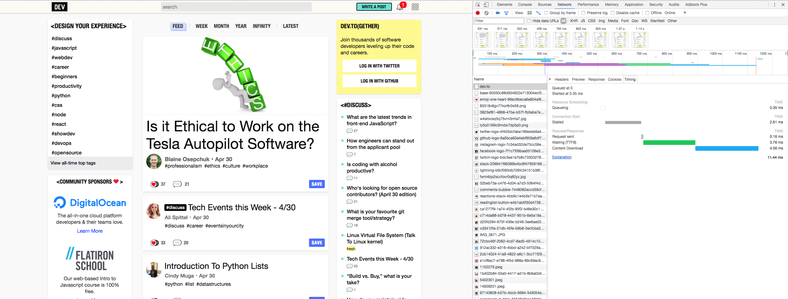

# 打開 [dev.to] 看看吧

[dev.to]: https://dev.to/

---

## [dev.to]

- 開發者資訊文章投稿服務
- 因為「**顯示超快**」成為了話題
- 由 The Practical Dev 公司開發營運
- 他們將 [**New York City 作為據點**](https://dev.to/about)

---

## 用瀏覽器的開發者工具看看吧

- 應該已經在其他課程介紹過了
- macOS 的 Chrome 的話 `Alt(Option) + Cmd + i`
    - 應該會成為長久的夥伴

(2018/05/01的某時刻擷取的畫面)
