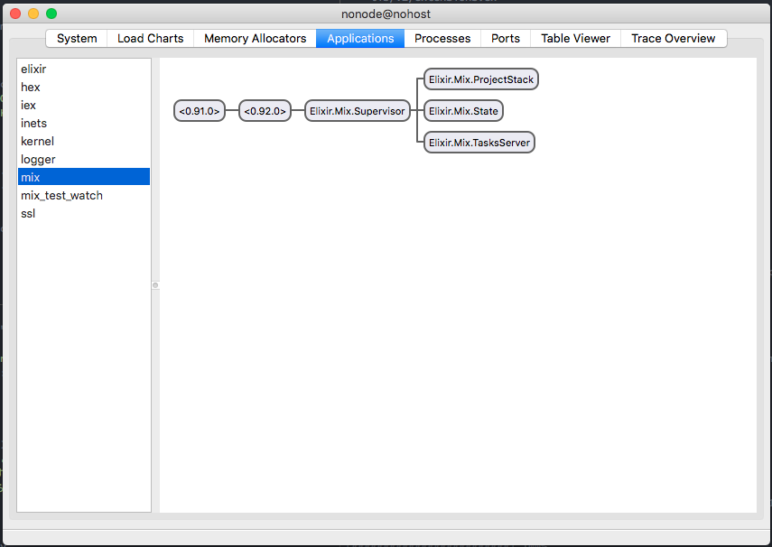
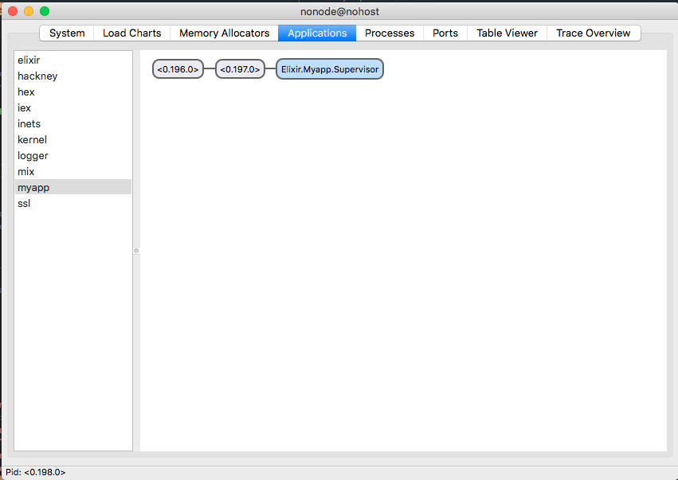

## 発展: OTP に触れる

- 時間が余ったら触れる予定

---

- Erlang には**OTP**という枠組みがあります
  - 軽量プロセスを構成要素とし、
  - プロセス間のメッセージパッシングによって協調処理を実現、
  - OTP アプリケーション内部のプロセスに階層構造をもたせ、
  - 上位のプロセスが下位のプロセスの死活監視(**Supervise**)をし、
  - 個々のプロセスで例外発生(クラッシュ)した場合は、
    そのプロセスを殺して新たな同等のプロセスを立ち上げる
- こういった仕組みによって、
  - 例外による影響の局所化
  - 容易な並列処理の実装
  - 必要に応じて状態の保持
- などを可能にします

---

- 気づいた方もいるかもしれませんが、Elixir には"Class"とか"Object"と言った概念がでてきません
- アプリケーション内部に「状態」をもたせようと思った場合、 **純粋; pure** な module と関数だけでは不足します
  - ここでいう純粋とは、関数が内部状態や副作用を持たず、同じ入力には常に同じ出力を返す性質
- Erlang/Elixir では**状態は軽量プロセスに保持**させます
  - 状態を持っているプロセスに、適切な **メッセージ; message** を送ってクエリや更新を要求します
    - まさしく、VM 内のプロセス間に**クライアント・サーバモデルの関係が当てはまる**と思ってください
    - メッセージは各プロセスの**メールボックス; mailbox**に届けられ、FIFO で処理されます

---

### 見てみる

- プロジェクトディレクトリで`iex -S mix`してみましょう
- `:observer`という Erlang の機能を利用して、VM の内部状態を観測してみます

```
$ iex -S mix
Erlang/OTP 20 [erts-9.2] [source] [64-bit] [smp:4:4] [ds:4:4:10] [async-threads:10] [hipe] [kernel-poll:false]

Compiling 1 file (.ex)
Generated myapp app
Interactive Elixir (1.5.3) - press Ctrl+C to exit (type h() ENTER for help)
iex(1)> :observer.start()
:ok
```

- GUI が立ち上がるはずです

[](observer.png)

- まず"Applications"タブを見てみるのがいいでしょう
- VM 内で起動しているアプリケーションが一覧できます
  - `elixir`自体も実行時アプリケーションを持っていたり、`mix`もアプリケーションだったり
- そして、アプリケーションを選択すると、そのアプリケーションのプロセスツリー(**Supervision Tree**)が一覧できます
  - プロセスにはそれぞれ**PID**がついています
  - 一部のプロセスには名前がついています(**registered name**)

---

### 立ち上げてみる

- ここで`myapp`が"Applications"欄にないことに気づきます
- `myapp`は実はまだ「アプリケーション」として定義していないのです。定義してみましょう
  - Erlang/Elixir で一般的に開発を行うにあたっては重要かつ必要な部分ですが、
    実は Antikythera では相当部分を一般の開発者から隠蔽しており、普段はあまり触れない部分かもしれません

---

- 以下のように編集していきましょう

> `mix.exs`

```diff
diff --git a/myapp/mix.exs b/myapp/mix.exs
index dfa8fc7..589379e 100644
--- a/myapp/mix.exs
+++ b/myapp/mix.exs
@@ -15,6 +15,7 @@ defmodule Myapp.Mixfile do
   # Run "mix help compile.app" to learn about applications.
   def application do
     [
+      mod: {Myapp, []},
       extra_applications: [:logger]
     ]
   end
```

> `lib/myapp.exs`

```diff
diff --git a/myapp/lib/myapp.ex b/myapp/lib/myapp.ex
index 9688770..b4a2958 100644
--- a/myapp/lib/myapp.ex
+++ b/myapp/lib/myapp.ex
@@ -2,6 +2,11 @@ defmodule Myapp do
   @moduledoc """
   Documentation for Myapp.
   """
+  use Application
+
+  def start(_type, _args) do
+    Myapp.Supervisor.start_link()
+  end

   @doc """
   Hello world.
```

- そして Supervisor module を追加します

> `lib/myapp/supervisor.ex`

```elixir
defmodule Myapp.Supervisor do
  use Supervisor

  def start_link() do
    Supervisor.start_link(__MODULE__, nil, name: __MODULE__)
  end

  def init(_arg) do
    Supervisor.init([], strategy: :one_for_one)
  end
end
```

- この状態で保存し、再び`iex -S mix`で起動、observer を見てみましょう

[](sup.png)

- おめでとう！ `myapp`は OTP アプリケーションとなり、プロセスツリーを手に入れました

- 今後、`myapp`が実行時に何か状態を持ちたいということになったなら、
  - `Myapp.Supervisor`配下に、状態保持用のプロセスを生やす
  - そのプロセスに対し、メッセージパッシングで値を出し入れするような API を定義する
  - アプリケーション内外から、その API を使ってプロセスにアクセスし、状態を利用する
- といった流れになります。 このあたりをより深く知りたいと思ったら、
  - [Official Introduction](https://elixir-lang.org/getting-started/introduction.html)や
    [Elixir School](https://elixirschool.com/ja/lessons/basics/basics/)を更に読み進めてみましょう
  - Erlang 関連の入門書([すご E](http://amzn.asia/9Vo8clh)など)もおすすめです。英語で良ければ Web 版もあります
  - 慣れてきたら、Antikythera のソースコードを読んでみるのもいいかも

---

### さらに発展: OTP と戯れる

- 更に OTP の挙動を見てみたい場合は時間のあるときにやってみましょう
  - もしやってみた場合は、ぜひコードを拝見させてください。わからないことがあったときも遠慮なくどうぞ
- `Myapp.Supervisor`に子プロセス(Worker プロセス)を生やしてみる
  - [`GenServer`](https://elixirschool.com/ja/lessons/advanced/otp-concurrency/#genserver)
    を使えば Worker プロセスの挙動を定義する module は比較的簡単に作れます
- 子プロセスを殺してみる
  - このあたりは`iex -S mix`からいじってみるのが簡単です
  - プロセスの PID を特定するには、`Process.whereis/1`で registered name から解決するか、
    `Supervisor.which_children/1`で Supervisor の子プロセスリストから調べる方法があります
- 逆に、Supervise されていないプロセスを起動してみる
